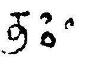
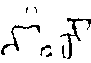
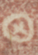
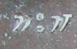
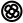
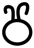
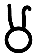
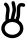
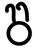
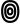

## Circles
- for symbols that are circular or have a circle as their most prominent element, use the genus token “circle”
- the transliteration shorthand @ stands for <g type="circle">.</g>
a <g> element (empty or containing a . character) with a @type starting with “circle” shall be provisionally displayed as ◯

|archetype|description|preferred token|specimens|alternative token(s)|remarks, clipping source|
|:-----:|:-----:|:-----:|:-----:|:-----:|:-----:|
|ABC&#9675;|small circle (noticeably smaller than a typical character body), placed at median height; Cambodian “Chicken egg”|circleMed||circle circleSmall||
|ABC&#9711;|large circle (about the size of a typical character body or larger)|circleLarge||||
|ABC&deg;|small circle above median line|circleHigh|1.  (the two circles on the left are a visarga; the symbol is the single circle on the right)||1. tfb-badamicalukya-epigraphy/CalE01-Makarappi-Pulakesin2|
|ABC&#9675;|small circle below median line|circleLow|1. ||1. tfb-badamicalukya-epigraphy/CalE01-Makarappi-Pulakesin2|
||circle with cross inside|circleCross|1. |||
||two circles, one above the other, like a visarga|circleDouble|1. |||
||circle with a floret inside|circleFloret||circleFinial||
||circle topped by a double (or multiple) curved stroke|circleHorned|1. 2. 3.|egg2apo||
||circle containing one or more concentric circles, Cambodian &ldquo;Chicken eye&rdquo;|circleConcentric|1. 2.|eye circleTarget||
|&#9737;|circle with a concentric dot, Cambodian &ldquo;Chicken eye&rdquo;|circleTarget||eye||
||three small circles arranged in a triangle|circleTriangle||||
