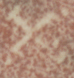

## Crosses
- for symbols that consist of, or are predominantly derived from, two straight lines crossing at a right angle, use the genus token “cross”
- a <g> element (empty or containing a . character) with a @type starting with “cross” shall be provisionally displayed as 🞩

|archetype|description|preferred token|specimens|alternative token(s)|remarks, clipping source|
|:-----:|:-----:|:-----:|:-----:|:-----:|:-----:|
||cross in the shape of a + sign|crossPlus||||
||cross in the shape of an &times;|crossX|1.||
