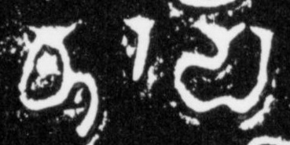
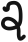

## Tall, single vertical bars (daṇḍa)
- for symbols that consist of, or are palaeographically derived from, a single vertical bar that is about as tall as an average character body, use the genus token “danda”
- the transliteration shorthand | stands for `<g type="danda">.</g>`
- the transliteration shorthand / stands for `<g type="dandaOrnate">.</g>`
- a `<g>` element (empty or containing a . character) with a `@type` starting with “danda” shall be provisionally displayed as |

|archetype|description|preferred token|specimens|alternative token(s)|remarks, clipping source|
|:-----:|:-----:|:-----:|:-----:|:-----:|:-----:|
||plain vertical bar|dandaPlain||||
||vertical bar with a hook on top|dandaHooked||||
||vertical bar crossed by a predominantly horizontal line|dandaCross||||
||vertical bar with a headmark or small horizontal line on top|dandaSerif|||tfb-vengicalukya-epigraphy/CalE41-Diggubarru-Bhima2|
||vertical bar with more complex ornamentation|dandaOrnate||||
