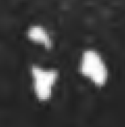

## Dots
- for symbols that consist of one or more dots or very small circles and no other marks, use the genus token “dot”
- a <g> element (empty or containing a . character) with a @type starting with “dot” shall be provisionally displayed as °

|archetype|description|preferred token|specimens|alternative token(s)|remarks, clipping source|
|:-----:|:-----:|:-----:|:-----:|:-----:|:-----:|
|ABC&#8729;|median dot|dotMid||||
||two dots, one above the other, like a visarga|dotDouble||||
||three dots arranged in a triangle|dotTriangle|1.|dotTriple|1. tfb-vengicalukya-epigraphy/CalE11-Cipurupalle-Visnuvardhana1|

@if we separate rings from dots, ◦ may be used as display for rings and • for dots
