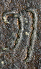
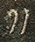
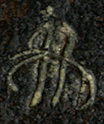
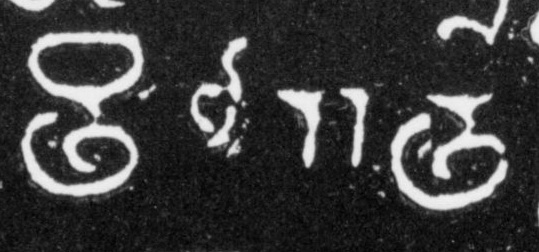
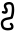
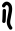
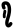
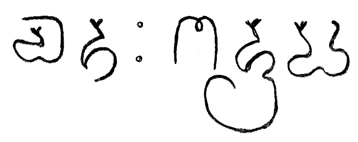
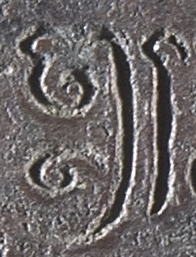

## Tall, double vertical bars (double daṇḍa)
- for symbols that consist of, or are palaeographically derived from, a double vertical bar as typically used for punctuation in many Indic scripts, use the genus token “ddanda” (for “double daṇḍa”)
- the transliteration shorthand || stands for `<g type="ddanda">.</g>`
- the transliteration shorthand // stands for `<g type="ddandaOrnate">.</g>`
- a `<g>` element (empty or containing a . character) with a `@type` starting with “ddanda” shall be provisionally displayed as ǁ

|archetype|description|preferred token|specimens|alternative token(s)|remarks, clipping source|
|:-----:|:-----:|:-----:|:-----:|:-----:|:-----:|
||plain double vertical bar|ddandaPlain||||
||double vertical bar with a hook on top of one or both bars| ddandaHooked|1.  2. || 1. Guntur, Java, very early 10th c.  2. Munduan, Java, very early 9th c.|
||double vertical bar crossed by a predominantly horizontal line<a href="#cmnt6" id="cmnt_ref6">[f]</a><a href="#cmnt7" id="cmnt_ref7">[g]</a>|ddandaCross| 1.  2. || 1. Pandaan inscription, Java, 11th c.  2. Guntur inscription, Java, very early 10th c.|
|| double vertical bar with a headmark or small horizontal line on top| ddandaSerif| 1. 1. Pandaan inscription, Java, 11th c.2. Guntur inscription, Java, very early 10th c.||| 1. tfb-vengicalukya-epigraphy/CalE41-Diggubarru-Bhima2|
|| double vertical bar with more complex ornamentation| ddandaOrnate| 1. 2.  3.  lana&#7717; // n&#7771;pa 4. ||1.2.3. INSPallava00314 4. MpuMano (Java, 13th c.)|
