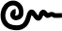
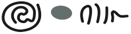
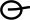
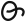
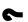
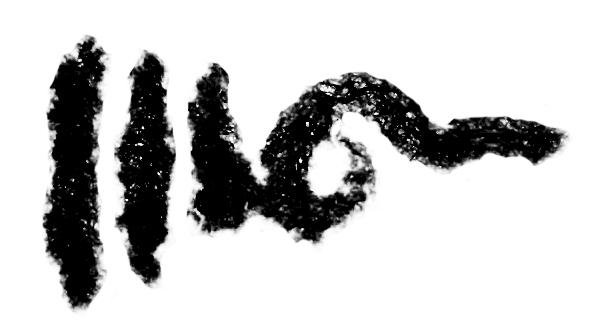
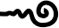
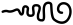
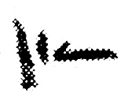
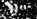

## Gomūtra
- for symbols that consist of, or are stylised renderings of, a wavy line of gradually increasing or decreasing amplitude (with or without a squiggle at the widest end), use the genus token “gomutra”
- display suggestion: U+00B6 ¶ Pilcrow Sign; possibly also U+204B ⁋ Reversed Pilcrow Sign so that one of these stands for initial, and the other for final gomūtras

|archetype|description|preferred token|specimens|alternative token(s)|remarks, clipping source|
|:-----:|:-----:|:-----:|:-----:|:-----:|:-----:|
||final gom&#363;tra|gomutraFinal|1.  2.  3.  4.  5. |finalGomutra||
||initial gom&#363;tra|gomutraInitial| 1.  2. |initialGomutra||

**ALTERNATIVE GOMŪTRA CLASSIFICATION, with a bit more detail**

|archetype|description|preferred token|specimens|alternative token(s)|remarks, clipping source|
|:-----:|:-----:|:-----:|:-----:|:-----:|:-----:|
||generic final gom&#363;tra|gomutraFinal||finalGomutra||
||final gom&#363;tra rendered as a tapering series of vertical bars|gomutraFinalBars|1.  2. |||
||final involving a more complex design than the archetypal rendering|gomutraFinalComplex|1.  2. |||
||generic initial gom&#363;tra|gomutraInitial|1.  2. |initialGomutra||

in this alternative, the variants  and  should be reclassified into the genus “circle”, and the variant . should be reclassified into whatever spiral genus we create for these
