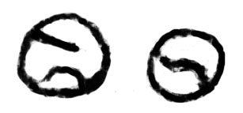
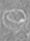
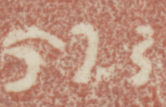

## Miscellaneous/unclassified
- symbols that don’t seem to fit any of the numbered species above may be added here
- a <g> element (empty or containing a . character) with a @type that does not start with one of the genus names listed above shall be provisionally displayed as NEED SUGGESTION

|archetype|description|preferred token|specimens|alternative token(s)|remarks, clipping source|
|:-----:|:-----:|:-----:|:-----:|:-----:|:-----:|
||circle with one or more curved lines|tennisBall|1. ||1. Wurudu Kidul, Java, 929 CE|
|||squiggleVertical||braceCurlyClose||

