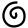
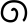
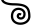
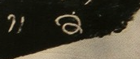

## Spirals
- for symbols based on a spiral line, use the genus token “spiral”
- a <g> element (empty or containing a . character) with a @type starting with “spiral” shall be provisionally displayed as @

|archetype|description|preferred token|specimens|alternative token(s)|remarks, clipping source|
|:-----:|:-----:|:-----:|:-----:|:-----:|:-----:|
||clockwise (right-turning) spiral (like a figure 6 or 9)|spiralR||||
||counter-clockwise (left-turning) spiral (like a mirrored figure 6 or 9)|spiralL|1. 2.||2. Munduan, Java, very early 9th c.|
