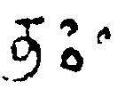
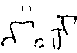
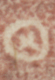
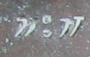
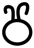
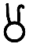
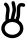
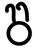

## Circles
- for symbols that are circular or have a circle as their most prominent element, use the genus token “circle”
- the transliteration shorthand @ stands for <g type="circle">.</g>
a <g> element (empty or containing a . character) with a @type starting with “circle” shall be provisionally displayed as ◯

|archetype|description|preferred token|specimens|alternative token(s)|remarks, clipping source|
|:-----:|:-----:|:-----:|:-----:|:-----:|:-----:|
|||||||

<table class="c52"><tbody><tr class="c16"><td class="c23" colspan="1" rowspan="1">
archetype
</td><td class="c32" colspan="1" rowspan="1">
description
</td><td class="c34" colspan="1" rowspan="1">
preferred token
</td><td class="c39" colspan="1" rowspan="1">
specimens
</td><td class="c39" colspan="1" rowspan="1">
alternative token(s)
</td><td class="c17" colspan="1" rowspan="1">
remarks, clipping source
</td></tr><tr class="c5"><td class="c8" colspan="1" rowspan="1">
ABC&#9675;
</td><td class="c33" colspan="1" rowspan="1">
small circle<a href="#cmnt29" id="cmnt_ref29">[ac]</a><a href="#cmnt30" id="cmnt_ref30">[ad]</a><a href="#cmnt31" id="cmnt_ref31">[ae]</a>&nbsp;(noticeably smaller than a typical character body), placed at median height; Cambodian &ldquo;Chicken egg&rdquo;
</td><td class="c18" colspan="1" rowspan="1">
circleMed
</td><td class="c6" colspan="1" rowspan="1">

</td><td class="c6" colspan="1" rowspan="1">
circle

circleSmall
</td><td class="c24" colspan="1" rowspan="1">

</td></tr><tr class="c5"><td class="c8" colspan="1" rowspan="1">
ABC&#9711;
</td><td class="c33" colspan="1" rowspan="1">
large circle (about the size of a typical character body or larger)
</td><td class="c18" colspan="1" rowspan="1">
circleLarge
</td><td class="c6" colspan="1" rowspan="1">

</td><td class="c6" colspan="1" rowspan="1">

</td><td class="c24" colspan="1" rowspan="1">

</td></tr><tr class="c5"><td class="c8" colspan="1" rowspan="1">
ABC&deg;
</td><td class="c33" colspan="1" rowspan="1">
small circle above median line
</td><td class="c18" colspan="1" rowspan="1">
circleHigh
</td><td class="c6" colspan="1" rowspan="1">
1. (the two circles on the left are a visarga; the symbol is the single circle on the right)
</td><td class="c6" colspan="1" rowspan="1">

</td><td class="c24" colspan="1" rowspan="1">
1. tfb-badamicalukya-epigraphy/CalE01-Makarappi-Pulakesin2
</td></tr><tr class="c5"><td class="c8" colspan="1" rowspan="1">
ABC&#9675;
</td><td class="c33" colspan="1" rowspan="1">
small circle below median line
</td><td class="c18" colspan="1" rowspan="1">
circleLow
</td><td class="c6" colspan="1" rowspan="1">
1. 
</td><td class="c6" colspan="1" rowspan="1">
&nbsp;
</td><td class="c24" colspan="1" rowspan="1">
1. tfb-badamicalukya-epigraphy/CalE01-Makarappi-Pulakesin2
</td></tr><tr class="c5"><td class="c8" colspan="1" rowspan="1">

</td><td class="c33" colspan="1" rowspan="1">
circle with cross inside
</td><td class="c18" colspan="1" rowspan="1">
circleCross
</td><td class="c6" colspan="1" rowspan="1">
1. 
</td><td class="c6" colspan="1" rowspan="1">
&nbsp;
</td><td class="c24" colspan="1" rowspan="1">
&nbsp;
</td></tr><tr class="c5"><td class="c8" colspan="1" rowspan="1">

</td><td class="c33" colspan="1" rowspan="1">
two circles, one above the other, like a visarga
</td><td class="c18" colspan="1" rowspan="1">
circleDouble
</td><td class="c6" colspan="1" rowspan="1">
1.
</td><td class="c6" colspan="1" rowspan="1">
&nbsp;
</td><td class="c24" colspan="1" rowspan="1">
&nbsp;
</td></tr><tr class="c5"><td class="c8" colspan="1" rowspan="1">

</td><td class="c33" colspan="1" rowspan="1">
circle with a floret inside
</td><td class="c18" colspan="1" rowspan="1">
circleFloret
</td><td class="c6" colspan="1" rowspan="1">

</td><td class="c6" colspan="1" rowspan="1">
circleFinial
</td><td class="c24" colspan="1" rowspan="1">
&nbsp;
</td></tr><tr class="c5"><td class="c8" colspan="1" rowspan="1">

</td><td class="c33" colspan="1" rowspan="1">
circle topped by a double (or multiple) curved stroke
</td><td class="c18" colspan="1" rowspan="1">
circleHorned
</td><td class="c6" colspan="1" rowspan="1">
1.

2.

3.
</td><td class="c6" colspan="1" rowspan="1">
egg2apo
</td><td class="c24" colspan="1" rowspan="1">
&nbsp;
</td></tr><tr class="c5"><td class="c8" colspan="1" rowspan="1">

</td><td class="c33" colspan="1" rowspan="1">
circle containing one or more concentric circles, Cambodian &ldquo;Chicken eye&rdquo;
</td><td class="c18" colspan="1" rowspan="1">
circleConcentric
</td><td class="c6" colspan="1" rowspan="1">
1.

2.
</td><td class="c6" colspan="1" rowspan="1">
eye

circleTarget
</td><td class="c24" colspan="1" rowspan="1">
&nbsp;
</td></tr><tr class="c5"><td class="c8" colspan="1" rowspan="1">
&#9737;
</td><td class="c33" colspan="1" rowspan="1">
circle with a concentric dot, Cambodian &ldquo;Chicken eye&rdquo;
</td><td class="c18" colspan="1" rowspan="1">
circleTarget
</td><td class="c6" colspan="1" rowspan="1">

</td><td class="c6" colspan="1" rowspan="1">
eye
</td><td class="c24" colspan="1" rowspan="1">
&nbsp;
</td></tr><tr class="c5"><td class="c8" colspan="1" rowspan="1">
&nbsp;
</td><td class="c33" colspan="1" rowspan="1">
three small circles arranged in a triangle
</td><td class="c18" colspan="1" rowspan="1">
circleTriangle
</td><td class="c6" colspan="1" rowspan="1">

</td><td class="c6" colspan="1" rowspan="1">
&nbsp;
</td><td class="c24" colspan="1" rowspan="1">
&nbsp;
</td></tr></tbody></table>
