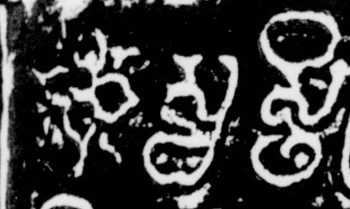
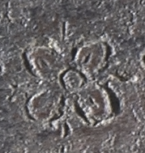
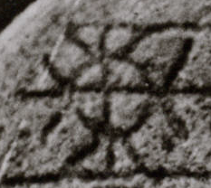
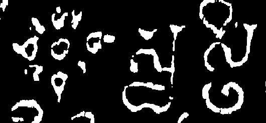

## Florets
- for symbols resembling stylised flowers, generally consisting of several petals arranged radially around a central circle, use the genus token “floret”
- a <g> element (empty or containing a . character) with a @type starting with “floret” shall be provisionally displayed as ✤

|archetype|description|preferred token|specimens|alternative token(s)|remarks, clipping source|
|:-----:|:-----:|:-----:|:-----:|:-----:|:-----:|
|||||||

<table class="c52"><tbody><tr class="c16"><td class="c23" colspan="1" rowspan="1">
archetype
</td><td class="c32" colspan="1" rowspan="1">
description
</td><td class="c34" colspan="1" rowspan="1">
preferred token
</td><td class="c39" colspan="1" rowspan="1">
specimens
</td><td class="c39" colspan="1" rowspan="1">
alternative token(s)
</td><td class="c17" colspan="1" rowspan="1">
remarks, clipping source
</td></tr><tr class="c5"><td class="c8" colspan="1" rowspan="1">
&nbsp;&nbsp;
</td><td class="c33" colspan="1" rowspan="1">
floret with four petals
</td><td class="c18" colspan="1" rowspan="1">
floretQuatrefoil
</td><td class="c6" colspan="1" rowspan="1">
1. 

2. 
</td><td class="c6" colspan="1" rowspan="1">
simpleFinial
</td><td class="c24" colspan="1" rowspan="1">
1. tfb-vengicalukya-epigraphy/CalE43-Akulamannandu-Bhima2

2. Mpu Mano&rsquo;s inscription, Java, 14th c.<a href="#cmnt32" id="cmnt_ref32">[af]</a><a href="#cmnt33" id="cmnt_ref33">[ag]</a>
</td></tr><tr class="c5"><td class="c8" colspan="1" rowspan="1">

</td><td class="c33" colspan="1" rowspan="1">
flower design with more detail than a centre and petals
</td><td class="c18" colspan="1" rowspan="1">
floretComplex
</td><td class="c6" colspan="1" rowspan="1">
1.

2.&nbsp;

3. 

4. 

5. 
</td><td class="c6" colspan="1" rowspan="1">
complexFinial

(3: spider) (4: simpleFinial)
</td><td class="c24" colspan="1" rowspan="1">
&nbsp;5. tfb-vengicalukya-epigraphy/CalE44-Elavarru-Amma2
</td></tr></tbody></table>
