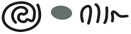
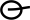
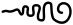

## Gomūtra
- for symbols that consist of, or are stylised renderings of, a wavy line of gradually increasing or decreasing amplitude (with or without a squiggle at the widest end), use the genus token “gomutra”
- display suggestion: U+00B6 ¶ Pilcrow Sign; possibly also U+204B ⁋ Reversed Pilcrow Sign so that one of these stands for initial, and the other for final gomūtras

<table class="c52"><tbody><tr class="c16"><td class="c23" colspan="1" rowspan="1">
archetype
</td><td class="c32" colspan="1" rowspan="1">
description
</td><td class="c34" colspan="1" rowspan="1">
preferred token
</td><td class="c39" colspan="1" rowspan="1">
specimens
</td><td class="c39" colspan="1" rowspan="1">
alternative token(s)
</td><td class="c17" colspan="1" rowspan="1">
remarks, clipping source
</td></tr><tr class="c5"><td class="c8" colspan="1" rowspan="1">

</td><td class="c33" colspan="1" rowspan="1">
final gom&#363;tra
</td><td class="c18" colspan="1" rowspan="1">
gomutraFinal
</td><td class="c6" colspan="1" rowspan="1">
1.

2.&nbsp;

3.

4.<a href="#cmnt36" id="cmnt_ref36">[aj]</a><a href="#cmnt37" id="cmnt_ref37">[ak]</a>

5.

</td><td class="c6" colspan="1" rowspan="1">
finalGomutra
</td><td class="c24" colspan="1" rowspan="1">
&nbsp;
</td></tr><tr class="c5"><td class="c8" colspan="1" rowspan="1">
&nbsp; 
</td><td class="c33" colspan="1" rowspan="1">
initial gom&#363;tra
</td><td class="c18" colspan="1" rowspan="1">
gomutraInitial
</td><td class="c6" colspan="1" rowspan="1">
1.

2.
</td><td class="c6" colspan="1" rowspan="1">
initialGomutra
</td><td class="c24" colspan="1" rowspan="1">
&nbsp;
</td></tr></tbody></table>

**ALTERNATIVE GOMŪTRA CLASSIFICATION, with a bit more detail**

|archetype|description|preferred token|specimens|alternative token(s)|remarks, clipping source|
|:-----:|:-----:|:-----:|:-----:|:-----:|:-----:|
|||||||

<table class="c52"><tbody><tr class="c16"><td class="c23" colspan="1" rowspan="1">
archetype
</td><td class="c32" colspan="1" rowspan="1">
description
</td><td class="c34" colspan="1" rowspan="1">
preferred token
</td><td class="c39" colspan="1" rowspan="1">
specimens
</td><td class="c39" colspan="1" rowspan="1">
alternative token(s)
</td><td class="c17" colspan="1" rowspan="1">
remarks, clipping source
</td></tr><tr class="c5"><td class="c8" colspan="1" rowspan="1">

</td><td class="c33" colspan="1" rowspan="1">
generic final gom&#363;tra
</td><td class="c18" colspan="1" rowspan="1">
gomutraFinal
</td><td class="c6" colspan="1" rowspan="1">

</td><td class="c6" colspan="1" rowspan="1">
finalGomutra
</td><td class="c24" colspan="1" rowspan="1">
&nbsp;
</td></tr><tr class="c5"><td class="c8" colspan="1" rowspan="1">

</td><td class="c33" colspan="1" rowspan="1">
final gom&#363;tra&nbsp;rendered as a tapering series of vertical bars
</td><td class="c18" colspan="1" rowspan="1">
gomutraFinalBars
</td><td class="c6" colspan="1" rowspan="1">
1.

2.
</td><td class="c6" colspan="1" rowspan="1">

</td><td class="c24" colspan="1" rowspan="1">

</td></tr><tr class="c5"><td class="c8" colspan="1" rowspan="1">

</td><td class="c33" colspan="1" rowspan="1">
final gom&#363;tra&nbsp;involving a more complex design than the archetypal rendering
</td><td class="c18" colspan="1" rowspan="1">
gomutraFinalComplex
</td><td class="c6" colspan="1" rowspan="1">
1.

2.
</td><td class="c6" colspan="1" rowspan="1">

</td><td class="c24" colspan="1" rowspan="1">

</td></tr><tr class="c5"><td class="c8" colspan="1" rowspan="1">
&nbsp; 
</td><td class="c33" colspan="1" rowspan="1">
generic initial gom&#363;tra
</td><td class="c18" colspan="1" rowspan="1">
gomutraInitial
</td><td class="c6" colspan="1" rowspan="1">
1.

2.
</td><td class="c6" colspan="1" rowspan="1">
initialGomutra
</td><td class="c24" colspan="1" rowspan="1">
&nbsp;
</td></tr></tbody></table>

in this alternative, the variants  and  should be reclassified into the genus “circle”, and the variant . should be reclassified into whatever spiral genus we create for these
