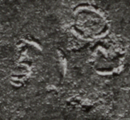
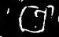
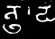

## Short vertical bars (half daṇḍa)
- for symbols that consist of, or are palaeographically derived from, a short, predominantly vertical bar that may be straight or curved, use the genus token “comma”
- the transliteration shorthand , stands for `<g type="comma">.</g>`
- a `<g>` element (empty or containing a . character) with a @type starting with “comma” shall be provisionally displayed as ,

|archetype|description|preferred token|specimens|alternative token(s)|remarks, clipping source|
|:-----:|:-----:|:-----:|:-----:|:-----:|:-----:|
|&#7006;|a short, curved vertical stroke at median height|comma|1. ||1. Kurangan, Java, 807 &#346;aka|
||a very short vertical line at median height|commaSmall|1.|dotCommaMid|1. tfb-vengicalukya-epigraphy/CalE29-Ederu-Vijayaditya1-2|
||a short vertical bar raised to head height|commaHigh|1. ||1. tfb-vengicalukya-epigraphy/CalE36-Cevuru-Amma1|
