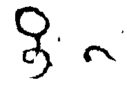
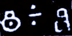

## Short horizontal strokes, single and double
- for symbols that consist of, or are predominantly derived from, a single horizontal bar as used for punctuation in some regions and periods, use the genus token “dash”
- the transliteration shorthand ~ stands for <g type="dash">~</g>
a <g> element (empty or containing a . character) with a @type starting with “dash” shall be provisionally displayed as ~

|archetype|description|preferred token|specimens|alternative token(s)|remarks, clipping source|
|:-----:|:-----:|:-----:|:-----:|:-----:|:-----:|
|||||||

<table class="c52"><tbody><tr class="c16"><td class="c23" colspan="1" rowspan="1">
archetype
</td><td class="c32" colspan="1" rowspan="1">
description
</td><td class="c34" colspan="1" rowspan="1">
preferred token
</td><td class="c39" colspan="1" rowspan="1">
specimens
</td><td class="c39" colspan="1" rowspan="1">
alternative token(s)
</td><td class="c17" colspan="1" rowspan="1">
remarks, clipping source
</td></tr><tr class="c5"><td class="c8" colspan="1" rowspan="1">
-
</td><td class="c33" colspan="1" rowspan="1">
short and quite straight horizontal line
</td><td class="c18" colspan="1" rowspan="1">
dashPlain
</td><td class="c6" colspan="1" rowspan="1">
1. 
</td><td class="c6" colspan="1" rowspan="1">

</td><td class="c24" colspan="1" rowspan="1">
1. tfb-badamicalukya-epigraphy/CalE05-Aihole-Pulakesin2
</td></tr><tr class="c5"><td class="c8" colspan="1" rowspan="1">
&nbsp;
</td><td class="c33" colspan="1" rowspan="1">
horizontal line with the middle bulging downward
</td><td class="c18" colspan="1" rowspan="1">
dashConcave
</td><td class="c6" colspan="1" rowspan="1">

</td><td class="c6" colspan="1" rowspan="1">
&nbsp;
</td><td class="c24" colspan="1" rowspan="1">
&nbsp;
</td></tr><tr class="c5"><td class="c8" colspan="1" rowspan="1">

</td><td class="c33" colspan="1" rowspan="1">
horizontal line with the middle bulging upward
</td><td class="c18" colspan="1" rowspan="1">
dashConvex<a href="#cmnt16" id="cmnt_ref16">[p]</a>
</td><td class="c6" colspan="1" rowspan="1">
1. 
</td><td class="c6" colspan="1" rowspan="1">
&nbsp;
</td><td class="c24" colspan="1" rowspan="1">
1. tfb-badamicalukya-epigraphy/CalE01-Makarappi-Pulakesin2
</td></tr><tr class="c5"><td class="c8" colspan="1" rowspan="1">

</td><td class="c33" colspan="1" rowspan="1">
horizontal line with a hook at one end or the other
</td><td class="c18" colspan="1" rowspan="1">
dashHooked
</td><td class="c6" colspan="1" rowspan="1">
1. 
</td><td class="c6" colspan="1" rowspan="1">
&nbsp;
</td><td class="c24" colspan="1" rowspan="1">
1. tfb-vengicalukya-epigraphy/CalE12-Timmapuram-Visnuvardhana1
</td></tr><tr class="c5"><td class="c8" colspan="1" rowspan="1">
~
</td><td class="c33" colspan="1" rowspan="1">
prominently sinuous horizontal line
</td><td class="c18" colspan="1" rowspan="1">
dashWavy
</td><td class="c6" colspan="1" rowspan="1">

</td><td class="c6" colspan="1" rowspan="1">

</td><td class="c24" colspan="1" rowspan="1">

</td></tr><tr class="c5"><td class="c8" colspan="1" rowspan="1">
&mdash;
</td><td class="c33" colspan="1" rowspan="1">
conspicuously long and quite straight horizontal line
</td><td class="c18" colspan="1" rowspan="1">
dashLong
</td><td class="c6" colspan="1" rowspan="1">

</td><td class="c6" colspan="1" rowspan="1">

</td><td class="c24" colspan="1" rowspan="1">

</td></tr><tr class="c5"><td class="c8" colspan="1" rowspan="1">
=
</td><td class="c33" colspan="1" rowspan="1">
two short and quite straight horizontal lines
</td><td class="c18" colspan="1" rowspan="1">
dashDouble
</td><td class="c6" colspan="1" rowspan="1">
1. 

2. 
</td><td class="c6" colspan="1" rowspan="1">
&nbsp;
</td><td class="c24" colspan="1" rowspan="1">
1. tfb-badamicalukya-epigraphy/CalE05-Aihole-Pulakesin2

2. tfb-badamicalukya-epigraphy/CalE06-Chiplun-Pulakesin2
</td></tr><tr class="c5"><td class="c8" colspan="1" rowspan="1">
&divide;
</td><td class="c33" colspan="1" rowspan="1">
a dash with a pair of dots above and below
</td><td class="c18" colspan="1" rowspan="1">
dashDoubledot
</td><td class="c6" colspan="1" rowspan="1">
1.
</td><td class="c6" colspan="1" rowspan="1">

</td><td class="c24" colspan="1" rowspan="1">
1. tfb-daksinakosala-epigraphy/Dk0005
</td></tr></tbody></table>
