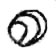
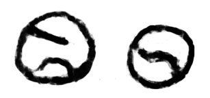
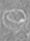
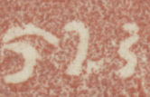

## Miscellaneous/unclassified
- symbols that don’t seem to fit any of the numbered species above may be added here
- a <g> element (empty or containing a . character) with a @type that does not start with one of the genus names listed above shall be provisionally displayed as NEED SUGGESTION

|archetype|description|preferred token|specimens|alternative token(s)|remarks, clipping source|
|:-----:|:-----:|:-----:|:-----:|:-----:|:-----:|
|||||||

<table class="c52"><tbody><tr class="c16"><td class="c23" colspan="1" rowspan="1">
archetype
</td><td class="c32" colspan="1" rowspan="1">
description
</td><td class="c34" colspan="1" rowspan="1">
preferred token
</td><td class="c39" colspan="1" rowspan="1">
specimens
</td><td class="c39" colspan="1" rowspan="1">
alternative token(s)
</td><td class="c17" colspan="1" rowspan="1">
remarks, clipping source
</td></tr><tr class="c5"><td class="c8" colspan="1" rowspan="1">

</td><td class="c33" colspan="1" rowspan="1">

</td><td class="c18" colspan="1" rowspan="1">

</td><td class="c6" colspan="1" rowspan="1">

</td><td class="c6" colspan="1" rowspan="1">

</td><td class="c24" colspan="1" rowspan="1">

</td></tr><tr class="c5"><td class="c8" colspan="1" rowspan="1">

</td><td class="c33" colspan="1" rowspan="1">
circle with one or more curved lines
</td><td class="c18" colspan="1" rowspan="1">
tennisBall<a href="#cmnt46" id="cmnt_ref46">[at]</a>
</td><td class="c6" colspan="1" rowspan="1">
1. 
</td><td class="c6" colspan="1" rowspan="1">
&nbsp;
</td><td class="c24" colspan="1" rowspan="1">
&nbsp;1. Wurudu Kidul, Java, 929 CE
</td></tr><tr class="c5"><td class="c8" colspan="1" rowspan="1">

</td><td class="c33" colspan="1" rowspan="1">

</td><td class="c18" colspan="1" rowspan="1">
squiggleVertical
</td><td class="c6" colspan="1" rowspan="1">

</td><td class="c6" colspan="1" rowspan="1">
braceCurlyClose
</td><td class="c24" colspan="1" rowspan="1">

</td></tr></tbody></table>
