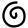
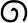
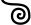
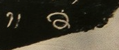

## Spirals
- for symbols based on a spiral line, use the genus token “spiral”
- a <g> element (empty or containing a . character) with a @type starting with “spiral” shall be provisionally displayed as @

|archetype|description|preferred token|specimens|alternative token(s)|remarks, clipping source|
|:-----:|:-----:|:-----:|:-----:|:-----:|:-----:|
|||||||

<table class="c52"><tbody><tr class="c16"><td class="c23" colspan="1" rowspan="1">
archetype
</td><td class="c32" colspan="1" rowspan="1">
description
</td><td class="c34" colspan="1" rowspan="1">
preferred token
</td><td class="c39" colspan="1" rowspan="1">
specimens
</td><td class="c39" colspan="1" rowspan="1">
alternative token(s)
</td><td class="c17" colspan="1" rowspan="1">
remarks, clipping source
</td></tr><tr class="c5"><td class="c8" colspan="1" rowspan="1">
&nbsp;&nbsp;
</td><td class="c33" colspan="1" rowspan="1">
clockwise (right-turning) spiral (like a figure 6 or 9)
</td><td class="c18" colspan="1" rowspan="1">
spiralR
</td><td class="c6" colspan="1" rowspan="1">

</td><td class="c6" colspan="1" rowspan="1">

</td><td class="c24" colspan="1" rowspan="1">
&nbsp;
</td></tr><tr class="c5"><td class="c8" colspan="1" rowspan="1">

</td><td class="c33" colspan="1" rowspan="1">
counter-clockwise (left-turning) spiral (like a mirrored figure 6 or 9)
</td><td class="c18" colspan="1" rowspan="1">
spiralL
</td><td class="c6" colspan="1" rowspan="1">
1.

2. 
</td><td class="c6" colspan="1" rowspan="1">

</td><td class="c24" colspan="1" rowspan="1">
2. Munduan, Java, very early 9th c.
</td></tr></tbody></table>
